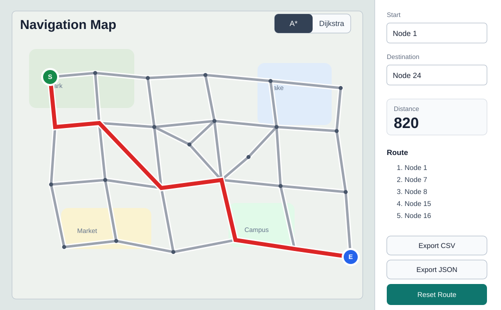

# C++ Map Navigation System

一个基于 C++ 的地图导航演示项目，使用 CSV 道路数据构建加权图，并实现 Dijkstra 与 A* 两种最短路径算法。项目同时提供命令行版本、SVG 路线预览和可交互的浏览器地图界面。

## 功能特点

- 使用 `nodes.csv` 和 `edges.csv` 加载路口与道路数据
- 基于邻接表构建双向加权图
- 支持 Dijkstra 最短路径算法
- 支持 A* 启发式搜索算法，启发函数为欧几里得距离
- 支持将路径结果导出为 CSV 和 JSON
- 支持生成带路线高亮的 SVG 地图预览
- 提供浏览器交互界面，可点击选择起点和终点

## 项目结构

```text
NavigationProject/
├─ include/              # 头文件
├─ src/                  # C++ 源码
├─ resources/            # CSV 地图数据
├─ ui/                   # 浏览器交互地图界面
├─ docs/                 # README 展示图
├─ CMakeLists.txt
└─ README.md
```

## 运行 C++ 版本

进入项目目录：

```bash
cd NavigationProject
```

使用 CMake：

```bash
cmake -S . -B build
cmake --build build
./build/navigate
```

如果没有安装 CMake，也可以直接用 clang 编译：

```bash
clang++ -std=c++17 -Iinclude src/main.cpp src/DataLoader.cpp src/Graph.cpp src/MapRenderer.cpp -o navigate
./navigate
```

可指定起点和终点：

```bash
./navigate resources/nodes.csv resources/edges.csv 1 24
```

交互式命令行模式：

```bash
./navigate --interactive
```

## 交互地图界面



在 `NavigationProject` 目录下启动本地预览服务：

```bash
python3 -m http.server 4173
```

然后在浏览器打开：

```text
http://localhost:4173/ui/index.html
```

交互界面支持点击选择起点和终点、切换 Dijkstra/A* 算法，并导出当前路线为 CSV、JSON 或 SVG。

## 数据格式

`resources/nodes.csv`

```csv
id,x,y
1,60,70
2,150,62
```

`resources/edges.csv`

```csv
from,to,distance
1,2,92
2,3,106
```

## 后续扩展

- 接入真实地图数据，如 OpenStreetMap
- 增加道路名称、限速、拥堵权重等属性
- 支持最短距离和最快时间两种路线策略
- 增加算法访问节点数与耗时对比
